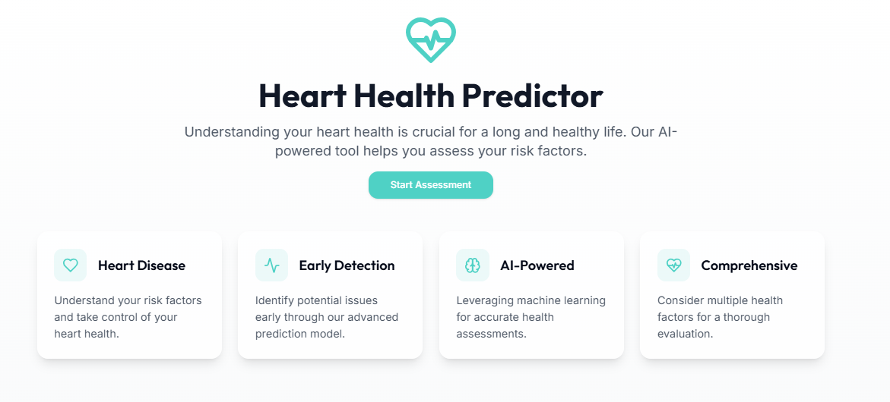

# Automated Ensemble Cardiometric Portal


## Description
This project implements a machine learning model ensemble using blending techniques to improve predictive accuracy. The system consists of a Flask backend serving the model and a React-based frontend for user interaction.

## Try it out Here !! 

**💻 Recommended: [Desktop View](https://cardiometric-portal.onrender.com) for the Best Experience**


## Installation and Setup on your Local System

### 1. Clone the Repository
```sh
git clone https://github.com/dhanyashreem2400/Automated_Ensemble_Cardiometric_Portal
```

### 2. Install Backend Dependencies
Navigate to the backend directory and install Python dependencies:
```sh
pip install -r requirements.txt
```

### 3. Install Frontend Dependencies
Navigate to the frontend directory and install Node.js dependencies:
```sh
npm install
```

### 4. Running the Application

#### Start the Flask Backend
In one terminal, navigate to the backend directory and run:
```sh
python app.py
```
This will start the Flask server on `http://localhost:5000`.

#### Start the React Frontend
In another terminal, navigate to the frontend directory and run:
```sh
npm run dev
```
This will start the frontend, which will be accessible at `http://localhost:8080`.

### 5. Accessing the Application
Once both the backend and frontend are running, you can access the application in your browser at `http://localhost:8080`.

## This project is built with .
+ Frontend:
  - Vite
  - TypeScript
  - React
  - shadcn-ui
  - Tailwind CSS
* Backend:
  - Flask
  - Machine Learning Models (Stacking & Blending)
* Deployed using:
  - Render


